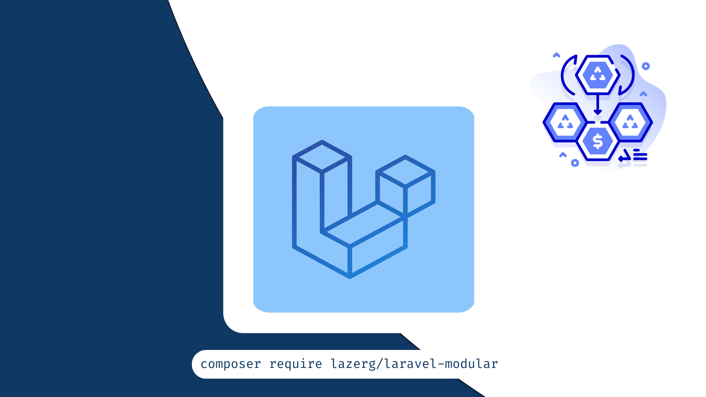

Dividing a Laravel project into modules enhances code organisation by isolating features and
functionalities into separate, manageable units. This modular approach improves scalability
by allowing each module to be developed, tested, and maintained independently, which
speeds up development and reduces the risk of conflicts.

It also promotes reusability, as modules can be easily reused in other projects, fostering
a more efficient development process and reducing duplication of effort.

## Installation

```bash
composer require lazerg/laravel-modular
```

## Create a new module

When we start a new project, we need to move current files to modules. Let's create `modules/User/app` directory.
And register it in `composer.json` file.

```json
{
    "autoload": {
        "psr-4": {
            "App\\": "app/",
            "Database\\Factories\\": "database/factories/",
            "Database\\Seeders\\": "database/seeders/",
            "Modules\\User\\": "modules/User/app/",
            "Modules\\User\\Database\\Factories\\": "modules/User/database/factories/",
            "Modules\\User\\Database\\Seeders\\": "modules/User/database/seeders/"
        }
    }
}
```

Do not forget to `composer dump-autoload` after changes.

After registering module, create `UserServiceProvider` in `modules/User/app` directory. It must
extend `ModuleServiceProvider`.
Next you need to register this service provider in `bootstrap/providers.php` file.

## Move default files to module

1. Move `/app/Modules/User` to `/modules/User/app/Modes/User`
2. Change `auth.providers.users.model` config to `Modules\User\Models\User`.
3. Move `/database/migrations/2014_10_12_000000_create_users_table.php`
   to `/modules/User/database/migrations/2014_10_12_000000_create_users_table.php`
4. Move `/database/factories/UserFactory.php` to `/modules/User/database/factories/UserFactory.php`

## Setup seeder

1. `database/seeders/DatabaseSeeder.php` must extend `ModularDatabaseSeeder`. And do not override `run` method.
2. Create `DatabaseSeeder` in `modules/User/database/seeders` directory. It must extend `BaseDatabaseSeeder`
3. Create `UserSeeder` in `modules/User/database/seeders` directory. It must extends `Illuminate\Database\Seeder`
4. Register `UserSeeder` in `DatabaseSeeder`'s `$earlySeeders` or `$seeders` property.

## Loaders

Inside `ModuleServiceProvider` we have different loaders:

| Path                                             | Register & Usage                                                                                                             |
|--------------------------------------------------|------------------------------------------------------------------------------------------------------------------------------|
| modules/{module}/app/Commands                    | $commands property in ServiceProvider                                                                                        |
| modules/{module}/app/Events                      | $events property in ServiceProvider                                                                                          |
| modules/{module}/app/Observers                   | $observers property in ServiceProvider                                                                                       |
| modules/{module}/app/Policies                    | $policies property in ServiceProvider                                                                                        |
| modules/{module}/config                          | all files from modules/{module}/config folder will be registered. Can be accessed like: config(’User::settings.max_attempt’) |
| modules/{module}/database/migrations             | all files from modules/{module}/database/migrations folder will be registered                                                |
| modules/{module}/routes                          | web.php, api.php and console.php will be registered                                                                          |
| modules/{module}/lang                            | Can be accessed like: trans(’User::details.full_name’)                                                                       |
| modules/{module}/views                           | Can be accessed like: view('User::about.details')                                                                            |
| modules/{module}/database/seeders/DatabaseSeeder | It must extend BaseDatabaseSeeder. Other seeders must be registered in its $earlySeeders or $seeders property                |

## Routes

### web.php

```php
Route::get('/index', [UserController::class, 'index'])->name('index');
```

| option     | default                         | modification                                                                                                                                  |
|------------|---------------------------------|-----------------------------------------------------------------------------------------------------------------------------------------------|
| name       | `users.index`                   | to make it user.index set $disableRoutePluralization = true in UserServiceProvider                                                            |
| namespace  | `Modules\User\Http\Controllers` |                                                                                                                                               |
| middleware | `[’web’, ‘auth’]`               | to remove auth set $mustBeAuthenticated = false in UserServiceSeeder . To make all routes for guest, set $mustBeGuest = true                  |
| url        | `/users/index`                  | to make it /user/index set $disableRoutePluralization = true in UserServiceProvider. To make it just /index set $disableWebRoutePrefix = true |

-------------------

### api.php

```php
Route::get('/index', [UserController::class, 'index'])->name('index');
```

| option     | default                           | modification                                                                                                                |
|------------|-----------------------------------|-----------------------------------------------------------------------------------------------------------------------------|
| name       | api.users.index                   | to make it api.user.index set $disableRoutePluralization = true in UserServiceProvider                                      |
| namespace  | Modules\User\Http\Api\Controllers |                                                                                                                             |
| middleware | [’api’, ‘auth’]                   | to remove auth set $mustBeAuthenticated = false in UserServiceSeeder. To make all routes for guest, set $mustBeGuest = true |
| url        | /api/users/index                  | to make it /api/user/index set $disableRoutePluralization = true in UserServiceProvider.                                    |